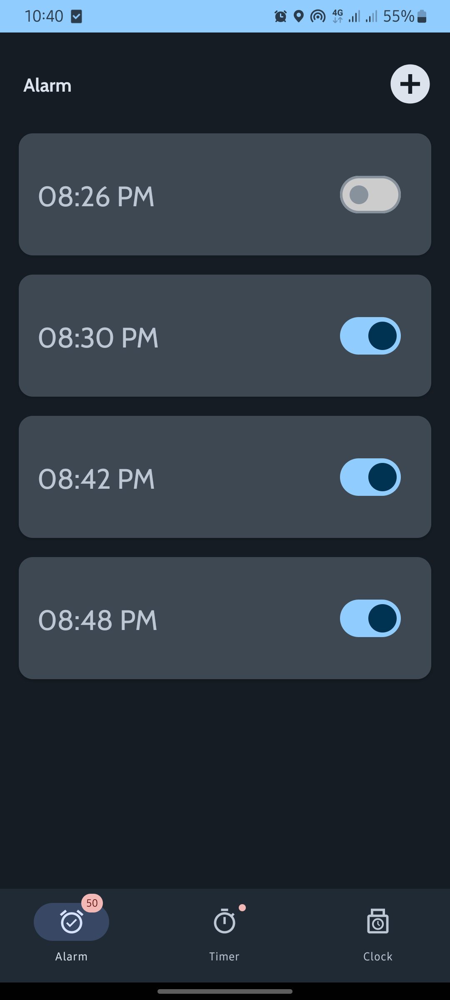
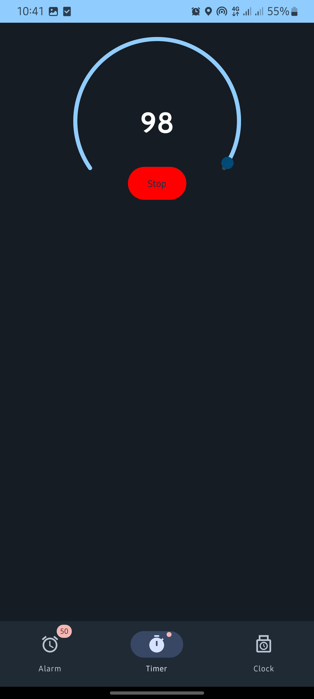
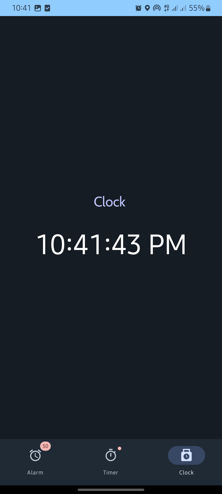

# MyClock

<p align="center">
  
  
  
</p>

## Description
This application serves as an alarm, timer, and local clock utility. The app features three main menus: Alarm, Timer, and Clock.
## Features
- Alarm Menu:
View a list of all alarms that have been set.
Add a new alarm by tapping the plus icon.
A new screen will appear where you can enter the alarm name, set the desired time, and then save it.
- Timer Menu:
Features a countdown timer initially set to 100 seconds.
Click the "Start" button to begin the countdown, and click it again to pause.
- Clock Menu:
Displays the current time in hours, minutes, and seconds according to the system time.

## Technologies Used
- Kotlin
- Android Studio
- Jetpack Compose

## Installation
1. Clone the repository:
    ```bash
    git clone https://github.com/OwariYagami/MyClock.git
    ```
2. Open the project in Android Studio
3. Build and run the project on an emulator or physical device

## Usage
1. Launch the app on your device.
2. Navigate to the "Alarm" menu to view existing alarms.
3. Tap the plus icon to add a new alarm.
4. Enter the alarm name, set the desired time, and tap "Save" to create the alarm.


## Contributing
1. Fork the repository
2. Create a new branch:
    ```bash
    git checkout -b feature-branch
    ```
3. Commit your changes:
    ```bash
    git commit -m 'Add some feature'
    ```
4. Push to the branch:
    ```bash
    git push origin feature-branch
    ```
5. Open a Pull Request

## License
This project is licensed under the MIT License - see the [LICENSE](LICENSE) file for details.
